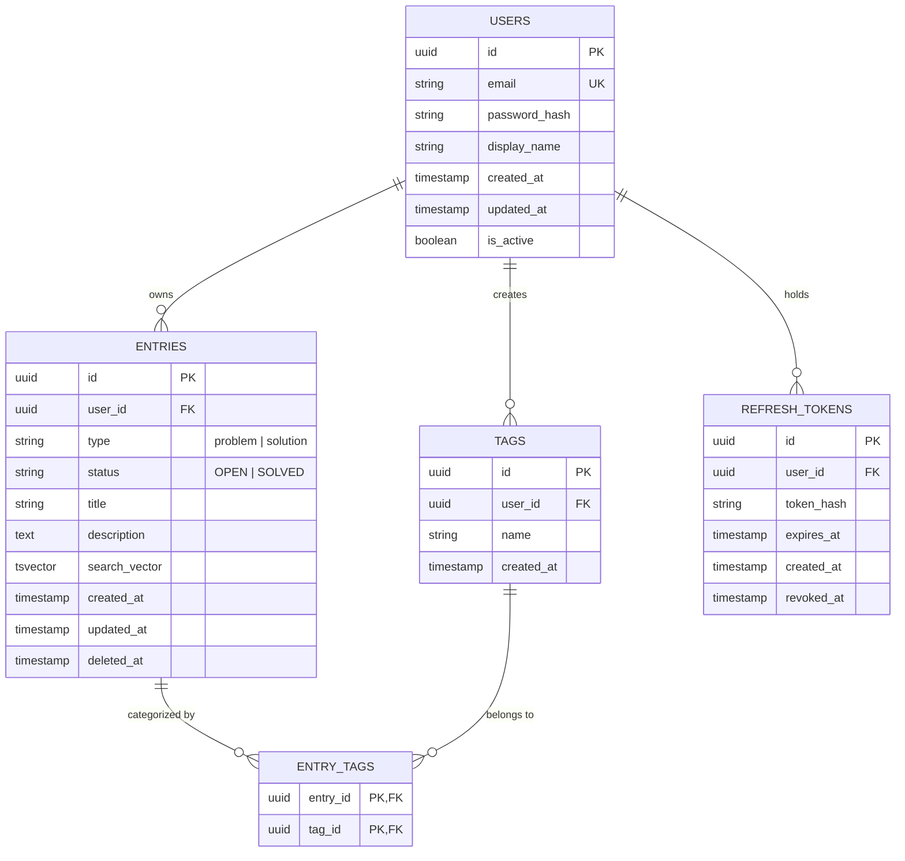

# Backend Architecture & REST API Specification

This document specifies the target backend architecture, data model, and complete REST API design for migrating **ProbSol Materialised** from Google Apps Script / Google Sheets to a standalone, secure, multi-tenant backend service.

---

## 1. Executive Summary & Migration Objectives

### 1.1 Motivation
The V0 implementation used Google Sheets and Google Apps Script as an interim database and API. While effective for rapid prototyping, Google Sheets exhibits critical bottlenecks:
- **No User Isolation**: A single spreadsheet is shared by all users; private thoughts cannot be kept confidential.
- **High Latency**: Average write times range from 1.5s to 3.5s due to Google Apps Script cold starts and Google Drive locking.
- **No Native Search or Query Indexing**: Performing text searches or filtering requires either client-side downloading of all entries or slow cell iteration.
- **Limited CRUD**: V0 lacks update/edit, deletion, and tag relationship management.

### 1.2 Target Objectives
1. **Multi-Tenant Authentication**: Secure user registration, authentication, and strict row-level data isolation.
2. **Dedicated Relational Database**: PostgreSQL with ACID compliance, primary/foreign keys, and transaction guarantees.
3. **Advanced Search & Filtering**: Sub-10ms full-text search across titles and descriptions with composite tag, type, and status filtering.
4. **Complete Note Lifecycle**: Create, Read, Update, Status toggle, and Soft Delete.
5. **Future-Proof Analytics**: Aggregate problem-to-solution ratios and timeline trends.

---

## 2. Recommended Tech Stack

| Component | Recommended Technology | Alternative Options | Rationale |
|---|---|---|---|
| **Runtime & Framework** | **Node.js (TypeScript) + Fastify** or **Express** | **NestJS**, **Go (Gin/Fiber)**, **Python (FastAPI)** | High throughput, shared TypeScript interfaces with frontend, rapid development. |
| **Primary Database** | **PostgreSQL (v15+)** | **MySQL (8+)** | Native `tsvector` / GIN indexing for full-text search, JSONB support, rock-solid ACID. |
| **ORM / Query Builder** | **Prisma** or **Drizzle ORM** | **TypeORM**, **Kysely** | End-to-end type safety, automated migrations, zero boilerplate. |
| **Caching & Rate Limiting** | **Redis** | In-memory (Upstash for serverless) | Token revocation blocklist, rate limiting, and cached search results. |
| **Auth Strategy** | **JWT (Access Token) + HTTP-Only Cookie (Refresh Token)** | Session cookies via Redis | Stateless horizontal scaling with secure token rotation. |
| **Validation** | **Zod** | Joi, Class-Validator | Shared validation schemas between client and server. |

---

## 3. Database Schema & Entity Relationship Diagram (ERD)



### 3.1 PostgreSQL DDL Schema

```sql
-- Enable UUID extension
CREATE EXTENSION IF NOT EXISTS "uuid-ossp";

-- Users Table
CREATE TABLE users (
    id UUID PRIMARY KEY DEFAULT uuid_generate_v4(),
    email VARCHAR(255) NOT NULL UNIQUE,
    password_hash VARCHAR(255) NOT NULL,
    display_name VARCHAR(100),
    created_at TIMESTAMPTZ NOT NULL DEFAULT CURRENT_TIMESTAMP,
    updated_at TIMESTAMPTZ NOT NULL DEFAULT CURRENT_TIMESTAMP,
    is_active BOOLEAN NOT NULL DEFAULT TRUE
);

-- Entries (Problems & Solutions) Table
CREATE TABLE entries (
    id UUID PRIMARY KEY DEFAULT uuid_generate_v4(),
    user_id UUID NOT NULL REFERENCES users(id) ON DELETE CASCADE,
    type VARCHAR(20) NOT NULL CHECK (type IN ('problem', 'solution')),
    status VARCHAR(20) NOT NULL CHECK (status IN ('OPEN', 'SOLVED')),
    title VARCHAR(300) NOT NULL,
    description TEXT DEFAULT '',
    search_vector TSVECTOR GENERATED ALWAYS AS (
        setweight(to_tsvector('english', coalesce(title, '')), 'A') ||
        setweight(to_tsvector('english', coalesce(description, '')), 'B')
    ) STORED,
    created_at TIMESTAMPTZ NOT NULL DEFAULT CURRENT_TIMESTAMP,
    updated_at TIMESTAMPTZ NOT NULL DEFAULT CURRENT_TIMESTAMP,
    deleted_at TIMESTAMPTZ DEFAULT NULL
);

-- Tags Table (Scoped per user so tags don't collide)
CREATE TABLE tags (
    id UUID PRIMARY KEY DEFAULT uuid_generate_v4(),
    user_id UUID NOT NULL REFERENCES users(id) ON DELETE CASCADE,
    name VARCHAR(50) NOT NULL,
    created_at TIMESTAMPTZ NOT NULL DEFAULT CURRENT_TIMESTAMP,
    CONSTRAINT uq_user_tag UNIQUE (user_id, name)
);

-- Join Table for Many-to-Many relationship between Entries and Tags
CREATE TABLE entry_tags (
    entry_id UUID NOT NULL REFERENCES entries(id) ON DELETE CASCADE,
    tag_id UUID NOT NULL REFERENCES tags(id) ON DELETE CASCADE,
    PRIMARY KEY (entry_id, tag_id)
);

-- Refresh Tokens Table for auth session tracking
CREATE TABLE refresh_tokens (
    id UUID PRIMARY KEY DEFAULT uuid_generate_v4(),
    user_id UUID NOT NULL REFERENCES users(id) ON DELETE CASCADE,
    token_hash VARCHAR(255) NOT NULL,
    expires_at TIMESTAMPTZ NOT NULL,
    revoked_at TIMESTAMPTZ DEFAULT NULL,
    created_at TIMESTAMPTZ NOT NULL DEFAULT CURRENT_TIMESTAMP
);

-- Performance & Search Indexes
CREATE INDEX idx_entries_user_created ON entries(user_id, created_at DESC) WHERE deleted_at IS NULL;
CREATE INDEX idx_entries_user_status ON entries(user_id, status) WHERE deleted_at IS NULL;
CREATE INDEX idx_entries_user_type ON entries(user_id, type) WHERE deleted_at IS NULL;
CREATE INDEX idx_entries_search ON entries USING GIN(search_vector) WHERE deleted_at IS NULL;
CREATE INDEX idx_tags_user ON tags(user_id);
```

---

## 4. Authentication & Security Architecture

### 4.1 Token Strategy
1. **Access Token (Short-lived)**:
    - Format: JSON Web Token (JWT).
    - Lifetime: 15 minutes.
    - Payload: `{ "sub": "<user_uuid>", "email": "user@example.com", "role": "user" }`.
    - Sent in: `Authorization: Bearer <token>` HTTP header.
2. **Refresh Token (Long-lived)**:
    - Format: Cryptographically secure random UUID or signed token.
    - Lifetime: 7 to 30 days.
    - Storage: HTTP-Only, Secure, `SameSite=Strict` cookie (`probsol_rt`).
    - Token Rotation: Every refresh rotation issues a new token pair and invalidates the previous token.

### 4.2 Multi-User Tenant Isolation
All entry and tag operations MUST enforce tenant scoping at the SQL query level:
```sql
-- Example: Fetching user entries
SELECT * FROM entries 
WHERE user_id = $auth_user_id AND deleted_at IS NULL;
```
No user can access, query, update, or delete any record where `user_id != req.user.id`.

---

## 5. Search & Filtering Engine System

### 5.1 Search Mechanics
The search system supports full-text search with ranking:
- **Title weight**: 'A' (higher relevance).
- **Description weight**: 'B' (standard relevance).
- Supports boolean queries and phrase searches via `websearch_to_tsquery('english', $searchTerm)`.
- Falls back to case-insensitive partial match (`ILIKE '%query%'`) for sub-word matching if needed.

### 5.2 Filter Criteria
The endpoint `GET /api/v1/entries` supports combined query parameters:

| Parameter | Type | Example | Description |
|---|---|---|---|
| `q` | `string` | `q=rabbitmq` | Full-text search across `title` and `description`. |
| `type` | `string` | `type=problem` | Filter by `problem` or `solution`. |
| `status` | `string` | `status=OPEN` | Filter by `OPEN` or `SOLVED`. |
| `tags` | `string` | `tags=architecture,redis` | Filter entries matching tags. |
| `tag_mode` | `string` | `tag_mode=all` | `any` (default) matches any tag; `all` requires all tags. |
| `from` | `string (ISO)` | `from=2026-01-01` | Filter entries created on or after date. |
| `to` | `string (ISO)` | `to=2026-12-31` | Filter entries created on or before date. |
| `sort` | `string` | `sort=created_at:desc` | Options: `created_at:desc`, `created_at:asc`, `title:asc`, `relevance`. |
| `page` | `integer` | `page=1` | 1-based page index (default: 1). |
| `limit` | `integer` | `limit=20` | Items per page (default: 20, max: 100). |

---

## 6. Complete REST API Endpoint Specification

All endpoints are prefixed with `/api/v1`.

### 6.1 Authentication Endpoints

#### 1. Register User
- **`POST /api/v1/auth/register`**
- **Auth Required**: No
- **Request Body**:
```json
{
  "email": "developer@example.com",
  "password": "SecurePassword123!",
  "displayName": "Anuj Tiwari"
}
```
- **Response `201 Created`**:
```json
{
  "success": true,
  "data": {
    "user": {
      "id": "e4b2d159-8641-48e0-a7d1-08ec13ef2b8e",
      "email": "developer@example.com",
      "displayName": "Anuj Tiwari",
      "createdAt": "2026-10-07T16:30:00.000Z"
    },
    "accessToken": "eyJhbGciOiJIUzI1NiIsInR5cCI6IkpXVCJ9..."
  }
}
```

#### 2. Login
- **`POST /api/v1/auth/login`**
- **Auth Required**: No
- **Request Body**:
```json
{
  "email": "developer@example.com",
  "password": "SecurePassword123!"
}
```
- **Response `200 OK`**:
```json
{
  "success": true,
  "data": {
    "user": {
      "id": "e4b2d159-8641-48e0-a7d1-08ec13ef2b8e",
      "email": "developer@example.com",
      "displayName": "Anuj Tiwari"
    },
    "accessToken": "eyJhbGciOiJIUzI1NiIsInR5cCI6IkpXVCJ9..."
  }
}
```
*(Sets HTTP-Only cookie `probsol_rt` with refresh token).*

#### 3. Refresh Access Token
- **`POST /api/v1/auth/refresh`**
- **Auth Required**: Cookie with valid refresh token
- **Response `200 OK`**:
```json
{
  "success": true,
  "data": {
    "accessToken": "eyJhbGciOiJIUzI1NiIsInR5cCI6IkpXVCJ9..."
  }
}
```

#### 4. Logout
- **`POST /api/v1/auth/logout`**
- **Auth Required**: Yes
- **Response `200 OK`**:
```json
{
  "success": true,
  "message": "Logged out successfully"
}
```
*(Clears refresh cookie and revokes token in database/Redis).*

#### 5. Get Current User Profile
- **`GET /api/v1/auth/me`**
- **Auth Required**: Yes (`Bearer <token>`)
- **Response `200 OK`**:
```json
{
  "success": true,
  "data": {
    "id": "e4b2d159-8641-48e0-a7d1-08ec13ef2b8e",
    "email": "developer@example.com",
    "displayName": "Anuj Tiwari",
    "createdAt": "2026-10-07T16:30:00.000Z"
  }
}
```

---

### 6.2 Entries (Problems & Solutions) Endpoints

#### 1. List Entries (with Search & Filtering)
- **`GET /api/v1/entries`**
- **Auth Required**: Yes
- **Query Parameters**:
    - `q` (optional): search term
    - `type` (optional): `problem` | `solution`
    - `status` (optional): `OPEN` | `SOLVED`
    - `tags` (optional): comma-separated string
    - `tag_mode` (optional): `any` | `all`
    - `from` (optional): ISO date
    - `to` (optional): ISO date
    - `sort` (optional): `created_at:desc` (default) | `created_at:asc` | `title:asc` | `relevance`
    - `page` (optional): integer (default: 1)
    - `limit` (optional): integer (default: 20)
- **Example Request**:
  `GET /api/v1/entries?q=rabbitmq&type=problem&status=OPEN&tags=backend,messaging&page=1&limit=20`
- **Response `200 OK`**:
```json
{
  "success": true,
  "data": {
    "items": [
      {
        "id": "7b2c0199-4c12-4029-9ef4-18c991fdf001",
        "type": "problem",
        "status": "OPEN",
        "title": "Need a better retry architecture for RabbitMQ consumers",
        "description": "Message reprocessing causes duplicate side effects on high lag.",
        "tags": ["backend", "messaging", "rabbitmq"],
        "createdAt": "2026-10-07T18:15:00.000Z",
        "updatedAt": "2026-10-07T18:15:00.000Z"
      }
    ],
    "pagination": {
      "page": 1,
      "limit": 20,
      "totalItems": 1,
      "totalPages": 1,
      "hasNextPage": false,
      "hasPrevPage": false
    }
  }
}
```

#### 2. Create Entry
- **`POST /api/v1/entries`**
- **Auth Required**: Yes
- **Request Body**:
```json
{
  "type": "problem",
  "status": "OPEN",
  "title": "Need a better retry architecture for RabbitMQ consumers",
  "description": "Message reprocessing causes duplicate side effects on high lag.",
  "tags": ["backend", "messaging", "rabbitmq"]
}
```
- **Validation Rules**:
    - `type`: required, must be `"problem"` or `"solution"`
    - `status`: optional (defaults to `OPEN` for problem, `SOLVED` for solution)
    - `title`: required, trimmed string (1 to 300 characters)
    - `description`: optional string (max 10,000 characters)
    - `tags`: optional array of strings (max 10 tags, 50 chars each)
- **Response `201 Created`**:
```json
{
  "success": true,
  "data": {
    "id": "7b2c0199-4c12-4029-9ef4-18c991fdf001",
    "type": "problem",
    "status": "OPEN",
    "title": "Need a better retry architecture for RabbitMQ consumers",
    "description": "Message reprocessing causes duplicate side effects on high lag.",
    "tags": ["backend", "messaging", "rabbitmq"],
    "createdAt": "2026-10-07T18:15:00.000Z",
    "updatedAt": "2026-10-07T18:15:00.000Z"
  }
}
```

#### 3. Get Entry by ID
- **`GET /api/v1/entries/:id`**
- **Auth Required**: Yes
- **Response `200 OK`**:
```json
{
  "success": true,
  "data": {
    "id": "7b2c0199-4c12-4029-9ef4-18c991fdf001",
    "type": "problem",
    "status": "OPEN",
    "title": "Need a better retry architecture for RabbitMQ consumers",
    "description": "Message reprocessing causes duplicate side effects on high lag.",
    "tags": ["backend", "messaging", "rabbitmq"],
    "createdAt": "2026-10-07T18:15:00.000Z",
    "updatedAt": "2026-10-07T18:15:00.000Z"
  }
}
```
- **Response `404 Not Found`**:
```json
{
  "success": false,
  "error": "Entry not found"
}
```

#### 4. Update Entry (Full or Partial Edit)
- **`PATCH /api/v1/entries/:id`**
- **Auth Required**: Yes
- **Request Body**:
```json
{
  "title": "Updated: RabbitMQ retry dead-letter policy",
  "description": "Use delayed exchanges and x-dead-letter-exchange headers.",
  "tags": ["backend", "rabbitmq", "architecture"],
  "type": "problem"
}
```
- **Response `200 OK`**:
```json
{
  "success": true,
  "data": {
    "id": "7b2c0199-4c12-4029-9ef4-18c991fdf001",
    "type": "problem",
    "status": "OPEN",
    "title": "Updated: RabbitMQ retry dead-letter policy",
    "description": "Use delayed exchanges and x-dead-letter-exchange headers.",
    "tags": ["backend", "rabbitmq", "architecture"],
    "createdAt": "2026-10-07T18:15:00.000Z",
    "updatedAt": "2026-10-07T18:30:00.000Z"
  }
}
```

#### 5. Toggle or Update Entry Status
- **`PATCH /api/v1/entries/:id/status`**
- **Auth Required**: Yes
- **Request Body**:
```json
{
  "status": "SOLVED"
}
```
- **Response `200 OK`**:
```json
{
  "success": true,
  "data": {
    "id": "7b2c0199-4c12-4029-9ef4-18c991fdf001",
    "status": "SOLVED",
    "updatedAt": "2026-10-07T18:35:00.000Z"
  }
}
```

#### 6. Delete Entry (Soft Delete)
- **`DELETE /api/v1/entries/:id`**
- **Auth Required**: Yes
- **Response `200 OK`**:
```json
{
  "success": true,
  "message": "Entry removed successfully"
}
```

---

### 6.3 Tags Management Endpoints

#### 1. List User's Tags (with Note Count)
- **`GET /api/v1/tags`**
- **Auth Required**: Yes
- **Response `200 OK`**:
```json
{
  "success": true,
  "data": [
    { "id": "t1", "name": "backend", "count": 14 },
    { "id": "t2", "name": "rabbitmq", "count": 5 },
    { "id": "t3", "name": "mobile", "count": 8 },
    { "id": "t4", "name": "react", "count": 12 }
  ]
}
```

---

### 6.4 Metrics & Analytics Endpoints (Roadmap V1 Support)

#### 1. Overview Summary
- **`GET /api/v1/analytics/summary`**
- **Auth Required**: Yes
- **Response `200 OK`**:
```json
{
  "success": true,
  "data": {
    "totalEntries": 48,
    "problems": {
      "total": 30,
      "open": 18,
      "solved": 12
    },
    "solutions": {
      "total": 18,
      "solved": 18
    },
    "solveRatio": 0.40,
    "topTags": [
      { "name": "backend", "count": 14 },
      { "name": "react", "count": 12 }
    ]
  }
}
```

---

## 7. Frontend Integration Architecture

To integrate the React 19 frontend with this backend:

### 7.1 New State & Context Structure

```
src/
├── context/
│   └── AuthContext.tsx           # Provides user, login, logout, register, isAuthenticated
├── components/
│   ├── ProtectedRoute.tsx        # Guards /capture, /timeline; redirects to /login
│   ├── SearchFilterBar.tsx       # Live search input, status pills, type chips, tag filter
│   └── EditEntryModal.tsx        # Edit modal for existing notes
├── pages/
│   ├── LoginPage.tsx             # Login form (email, password)
│   ├── RegisterPage.tsx          # Registration form
│   ├── CapturePage.tsx           # Existing capture form (updated with Auth headers)
│   └── TimelinePage.tsx          # Timeline with integrated SearchFilterBar
└── services/
    └── api.ts                    # Updated client with JWT header injection & auto-refresh
```

### 7.2 Updated API Client Pattern (`src/services/api.ts`)

```typescript
// Interceptor concept for Bearer tokens
let currentAccessToken: string | null = localStorage.getItem('probsol_token');

export function setAccessToken(token: string | null) {
  currentAccessToken = token;
  if (token) {
    localStorage.setItem('probsol_token', token);
  } else {
    localStorage.removeItem('probsol_token');
  }
}

async function authenticatedFetch(endpoint: string, options: RequestInit = {}) {
  const headers = new Headers(options.headers || {});
  headers.set('Content-Type', 'application/json');

  if (currentAccessToken) {
    headers.set('Authorization', `Bearer ${currentAccessToken}`);
  }

  let response = await fetch(`/api/v1${endpoint}`, {
    ...options,
    headers,
    credentials: 'include', // sends refresh token cookie
  });

  // Handle Token Expiry (401) with automatic refresh
  if (response.status === 401 && currentAccessToken) {
    const refreshSuccess = await refreshAccessToken();
    if (refreshSuccess) {
      headers.set('Authorization', `Bearer ${currentAccessToken}`);
      response = await fetch(`/api/v1${endpoint}`, {
        ...options,
        headers,
        credentials: 'include',
      });
    }
  }

  return response;
}
```

### 7.3 Timeline Search & Filter Component Design
On the Timeline screen, a unified filter control bar will sit above the feed:
- **Search Box**: Text input with 300ms debounce triggering `q=<search>`.
- **Type Toggle**: All | Problems | Solutions.
- **Status Filter**: All | Open | Solved.
- **Tag Selector**: Multi-select pills displaying top user tags.
- **Clear Filters Button**: Appears whenever active filters are applied.

---

## 8. Data Migration Plan (Google Sheets to PostgreSQL)

To migrate historical entries captured in Google Sheets into the new database:

### Migration Script Workflow (`scripts/migrate-from-sheets.ts`):
1. **Admin Seed**: Create the target user account in PostgreSQL.
2. **Fetch Legacy Rows**: Call the existing Google Apps Script endpoint (`doGet`) to fetch all JSON records.
3. **Normalize & Insert**:
    - For each legacy entry:
        - Map `id` (use existing UUID or generate new UUIDv4).
        - Map `user_id` to the target user.
        - Map `type` (`Problem` -> `problem`, `Solution` -> `solution`).
        - Map `status` (`OPEN` or `SOLVED`).
        - Extract comma-separated `tags`, insert into `tags` table (upsert), and create rows in `entry_tags`.
        - Retain historical `created_at` timestamp from the Google Sheet timestamp column.
4. **Validation Check**: Verify record counts match between Google Sheets and PostgreSQL `entries`.
