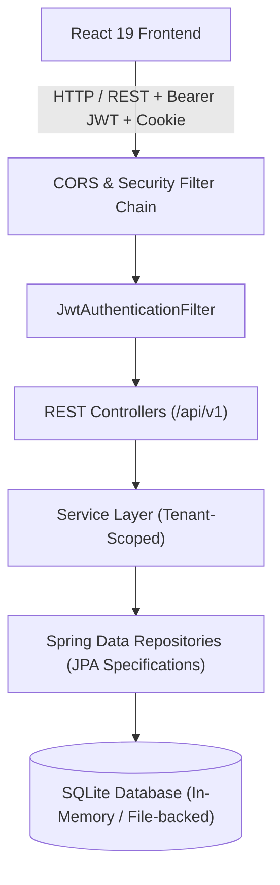
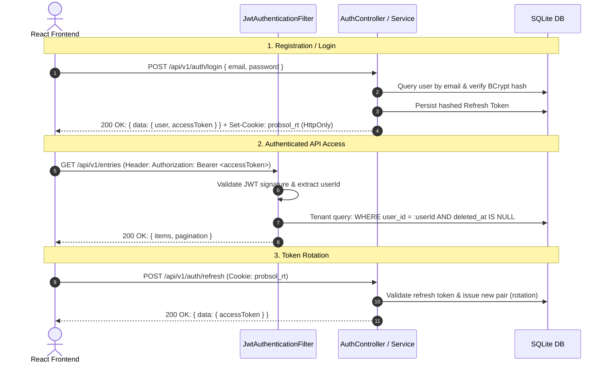

# ProbSol Backend Implementation Plan (Spring Boot + SQLite)

This plan outlines the architecture, implementation roadmap, and technical design for the **ProbSol Materialised** backend service built with **Spring Boot 3 (Java 21)** and **SQLite**.

The plan strictly preserves all fixed API contracts defined in [BackendExpectation.md](file:///Users/anujtiwari/Desktop/ProbSolBackend/BackendExpectation.md) to ensure seamless integration with the existing React frontend.

---

## 1. Architectural Overview & Tech Stack

### 1.1 Core Stack
- **Framework**: Spring Boot 3.4.x / Java 21
- **Web Layer**: Spring MVC (`spring-boot-starter-web`) + Spring Validation (`spring-boot-starter-validation`)
- **Security Layer**: Spring Security 6 (`spring-boot-starter-security`) + JJWT (Java JWT `0.12.x`) + BCrypt
- **Persistence Layer**: Spring Data JPA + Hibernate 6.x
- **Database**: SQLite (`org.xerial:sqlite-jdbc`) with `org.hibernate.orm:hibernate-community-dialects`
- **Documentation / Testing**: Spring Boot Test, MockMvc, JUnit 5



---

## 2. SQLite Configuration & Data Persistence Strategy

The user requirement specifies: **"sqlite here for a data source so that it is in memory"**.

### 2.1 SQLite In-Memory Connection Mechanics
Standard SQLite in-memory databases (`jdbc:sqlite::memory:`) are ephemeral and destroyed when a connection closes. Because Spring Boot uses HikariCP connection pooling, opening and closing connections would normally recreate the database.

**Our Solution**:
1. **Shared In-Memory SQLite**:
   ```properties
   spring.datasource.url=jdbc:sqlite:file:probsol_mem?mode=memory&cache=shared
   spring.datasource.driver-class-name=org.sqlite.JDBC
   spring.jpa.database-platform=org.hibernate.community.dialect.SQLiteDialect
   spring.jpa.hibernate.ddl-auto=update
   # Keep at least 1 idle connection open permanently to prevent in-memory DB destruction:
   spring.datasource.hikari.minimum-idle=1
   spring.datasource.hikari.maximum-pool-size=5
   spring.datasource.hikari.idle-timeout=0
   ```
2. **Dual-Profile Flexibility (Configurable)**:
   - `in-memory` (default / testing / ephemeral): `jdbc:sqlite:file:probsol_mem?mode=memory&cache=shared`
   - `persistent` (optional file mode for deployment persistence): `jdbc:sqlite:probsol.db`
   Both use the exact same schema and code, toggled with a single property.

---

## 3. Strict API Contract Adherence

All endpoints are mounted under `/api/v1`. Responses strictly match the JSON schemas from `BackendExpectation.md`.

### 3.1 Response Format Consistency
- Success responses:
  ```json
  { "success": true, "data": { ... } }
  ```
  or for simple actions:
  ```json
  { "success": true, "message": "Logged out successfully" }
  ```
- Error responses:
  ```json
  { "success": false, "error": "Descriptive error message" }
  ```

---

## 4. Authentication & Security Design (Production-Ready)

Because this service will be deployed, robust authentication and multi-tenant row-level data isolation are critical.



### 4.1 Token Specifications
| Token | Type | Expiry | Transport | Purpose |
|---|---|---|---|---|
| **Access Token** | JWT | 15 minutes | `Authorization: Bearer <token>` header | Short-lived authorization for all API calls |
| **Refresh Token** | Secure Random UUID / Token Hash | 7–30 days | `Set-Cookie: probsol_rt; HttpOnly; Secure; SameSite=Lax/None` | Long-lived session renewal with rotation |

### 4.2 Security Endpoints
1. **`POST /api/v1/auth/register`**: Validates email format, password (min 8 chars), display name. Hashes password using BCrypt. Generates access token & sets refresh token cookie. Returns `201 Created`.
2. **`POST /api/v1/auth/login`**: Authenticates credentials, generates token pair, sets refresh cookie. Returns `200 OK`.
3. **`POST /api/v1/auth/refresh`**: Extracts `probsol_rt` cookie (or optional fallback header), validates against database, rotates token, returns new `accessToken`. Returns `200 OK` or `401 Unauthorized`.
4. **`POST /api/v1/auth/logout`**: Invalidates refresh token in DB, clears `probsol_rt` cookie with `Max-Age=0`. Returns `200 OK`.
5. **`GET /api/v1/auth/me`**: Returns currently logged in user profile (`id`, `email`, `displayName`, `createdAt`).

### 4.3 Multi-Tenant Row-Level Security
- Every authenticated request sets `SecurityContext` with the authenticated `UserPrincipal` (containing `userId`).
- Every database query for `Entry` and `Tag` includes `userId` scoping:
  ```java
  entryRepository.findByIdAndUserIdAndDeletedAtIsNull(id, currentUser.getId())
  ```
- Ensures complete data isolation across different users.

### 4.4 CORS & Cookie Configuration
- Configured via `CorsConfigurationSource` to allow the frontend origin with credentials (`allowCredentials=true`).
- Supports headers: `Authorization`, `Content-Type`, `Accept`, `X-Requested-With`.
- Methods: `GET`, `POST`, `PATCH`, `DELETE`, `OPTIONS`.

---

## 5. Domain Model & SQLite Schema Design

### 5.1 Entities

1. **`User`**:
   - `id`: String (UUID)
   - `email`: String (Unique, Indexed)
   - `passwordHash`: String
   - `displayName`: String
   - `isActive`: Boolean
   - `createdAt`: Instant
   - `updatedAt`: Instant

2. **`Entry`** (Problem / Solution note):
   - `id`: String (UUID)
   - `user`: ManyToOne (`User`)
   - `type`: String (`"problem"` | `"solution"`)
   - `status`: String (`"OPEN"` | `"SOLVED"`)
   - `title`: String (1–300 chars)
   - `description`: String (TEXT, max 10,000 chars)
   - `tags`: Set / List of Strings or ManyToMany with `Tag`
   - `createdAt`: Instant
   - `updatedAt`: Instant
   - `deletedAt`: Instant (null if active, timestamp when soft-deleted)

3. **`Tag`**:
   - `id`: String (UUID)
   - `user`: ManyToOne (`User`)
   - `name`: String (lowercase, trimmed)
   - `createdAt`: Instant
   - Unique constraint: `(user_id, name)`

4. **`RefreshToken`**:
   - `id`: String (UUID)
   - `user`: ManyToOne (`User`)
   - `tokenHash`: String
   - `expiresAt`: Instant
   - `revokedAt`: Instant (null if valid)
   - `createdAt`: Instant

---

## 6. Entries Management & Search/Filter Engine

### 6.1 Query Capabilities (`GET /api/v1/entries`)
Implemented using Spring Data JPA **`Specification<Entry>`** (Criteria API) for dynamic composition:
- `q`: Case-insensitive partial match (`LOWER(title) LIKE %q%` OR `LOWER(description) LIKE %q%`).
- `type`: Matches exact type (`problem` or `solution`).
- `status`: Matches status (`OPEN` or `SOLVED`).
- `tags` + `tag_mode`:
  - `tag_mode=any`: Entry contains at least one of the specified tags.
  - `tag_mode=all`: Entry contains all specified tags.
- `from` & `to`: Filtering on `createdAt >= from` and `createdAt <= to`.
- `deleted_at`: Always `WHERE deleted_at IS NULL`.
- `sort`: Supports `created_at:desc` (default), `created_at:asc`, `title:asc`, and `relevance`.
- `page` & `limit`: 1-based page conversion to Spring's 0-based `PageRequest.of(page - 1, limit)`.

### 6.2 Pagination Response Contract
```json
{
  "page": 1,
  "limit": 20,
  "totalItems": 42,
  "totalPages": 3,
  "hasNextPage": true,
  "hasPrevPage": false
}
```

### 6.3 Soft Delete & Status Toggle
- `PATCH /api/v1/entries/:id/status`: Updates `status` and `updatedAt`.
- `DELETE /api/v1/entries/:id`: Soft deletes by setting `deletedAt = Instant.now()`.

---

## 7. Tag & Analytics Endpoints

### 7.1 Tags (`GET /api/v1/tags`)
- Aggregates non-deleted entries for the authenticated user.
- Returns list of `{ id, name, count }` sorted by count descending / name ascending.

### 7.2 Analytics Summary (`GET /api/v1/analytics/summary`)
Calculated dynamically for the user:
```json
{
  "totalEntries": 48,
  "problems": {
    "total": 30,
    "open": 18,
    "solved": 12
  },
  "solutions": {
    "total": 18,
    "solved": 18
  },
  "solveRatio": 0.40,
  "topTags": [
    { "name": "backend", "count": 14 },
    { "name": "react", "count": 12 }
  ]
}
```

---

## 8. Package Structure

```
src/main/java/com/probsol/
├── ProbSolApplication.java
├── config/
│   ├── SecurityConfig.java
│   ├── CorsConfig.java
│   ├── OpenApiConfig.java (optional Swagger)
│   └── SQLiteDialectConfig.java
├── security/
│   ├── JwtTokenProvider.java
│   ├── JwtAuthenticationFilter.java
│   ├── UserPrincipal.java
│   └── CustomUserDetailsService.java
├── controller/
│   ├── AuthController.java
│   ├── EntryController.java
│   ├── TagController.java
│   └── AnalyticsController.java
├── dto/
│   ├── request/
│   │   ├── RegisterRequest.java
│   │   ├── LoginRequest.java
│   │   ├── CreateEntryRequest.java
│   │   ├── UpdateEntryRequest.java
│   │   └── UpdateStatusRequest.java
│   └── response/
│       ├── ApiResponse.java
│       ├── UserResponse.java
│       ├── AuthResponse.java
│       ├── EntryResponse.java
│       ├── TagResponse.java
│       ├── AnalyticsSummaryResponse.java
│       └── PaginationMeta.java
├── entity/
│   ├── User.java
│   ├── Entry.java
│   ├── Tag.java
│   └── RefreshToken.java
├── repository/
│   ├── UserRepository.java
│   ├── EntryRepository.java
│   ├── TagRepository.java
│   └── RefreshTokenRepository.java
├── service/
│   ├── AuthService.java
│   ├── EntryService.java
│   ├── TagService.java
│   └── AnalyticsService.java
└── exception/
    ├── GlobalExceptionHandler.java
    ├── ResourceNotFoundException.java
    ├── BadRequestException.java
    └── UnauthorizedException.java
```

---

## 9. Implementation Roadmap & Milestones

1. **Phase 1: Project Setup & Dependencies**
   - Configure `pom.xml` with Spring Boot 3.4.x, Java 21, SQLite JDBC, Hibernate Community Dialects, Spring Security, JJWT, Validation.
   - Configure `application.yml` for shared in-memory SQLite and JPA.
2. **Phase 2: Database Entities & Repositories**
   - Create `User`, `Entry`, `Tag`, `RefreshToken` entities with proper mappings and UUID generators.
   - Create Spring Data JPA repositories with custom derived queries and specifications.
3. **Phase 3: Authentication & Security Engine**
   - Implement `JwtTokenProvider`, `JwtAuthenticationFilter`, `SecurityConfig`.
   - Implement `AuthService` and `AuthController` (`register`, `login`, `refresh`, `logout`, `me`).
   - Configure HttpOnly cookie management and token rotation.
4. **Phase 4: Entry CRUD & Search/Filter Specification**
   - Implement `EntryService` and `EntryController`.
   - Build dynamic JPA Specification for search (`q`), filters (`type`, `status`, `tags`, date range), sorting, and 1-based pagination.
   - Implement soft delete and status toggle.
5. **Phase 5: Tags & Analytics Modules**
   - Implement `TagService` & `TagController` with entry counts.
   - Implement `AnalyticsService` & `AnalyticsController` for summary calculations and solve ratio.
6. **Phase 6: Verification & Integration Testing**
   - End-to-end integration tests using MockMvc covering full auth flow, CRUD operations, search filters, and analytics.
   - Verify compatibility against the frontend contracts in `BackendExpectation.md`.

---

## 10. Key Questions & Discussion Points for You

1. **SQLite In-Memory vs File Persistence**:
   - For local development and testing, in-memory (`jdbc:sqlite:file:probsol_mem?mode=memory&cache=shared`) works great.
   - For actual deployment, would you like it default to file-backed SQLite (e.g. `probsol.db`) so user accounts and notes are preserved across server restarts, while keeping in-memory available via a Spring profile?
2. **Frontend Port / CORS Origin**:
   - What URL/port does your React frontend run on (e.g., `http://localhost:3000` or `http://localhost:5173`)? We can allow standard development ports or make it configurable via `app.cors.allowed-origins`.
3. **Seed Data / Migration**:
   - Would you like an optional initial seed script or dummy user/sample entries pre-loaded on startup for testing the frontend immediately?
